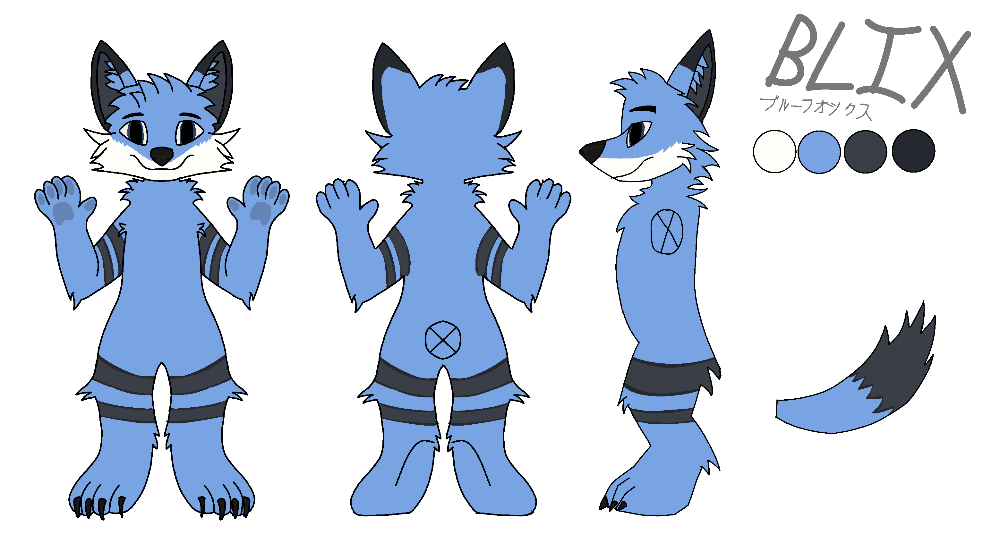

# Blix

Blix is a anthropomorphic fox which is my fursona (yes im a furry). Blix is a blue, white and black fox. His name comes from several things. The `Bl` part comes from the main colour of his fur which is blue. The `x` at the end comes from the second character from my username `0x4248`.

## Blix's other names

Blix also has a japanese name which is `ブルーフォックス` and means `Blue Fox`.

## Design

Here is the main reference sheet for Blix:

If you want the base for the ref sheet, you can find it [Here](ref_sheet/ref_sheet_sketch.png). The lines and sketch is licenced under CC-0 but the design of Blix is not.

### Key features
- Fox breed
- Demiboy (he/him, they/them)
- Blue, white, light grey and dark grey fur
    - White parts are below nose and go to sides
    - Light grey parts are in ears
    - Dark grey parts are on the outside of ears
- Blue fur on the inner parts of ears.
- Blue eyes
- Black bandana
- Black nose
- Body
	- Two grey stripes on each arm with a black outline around them.
	- Near the end of the tail it has grey fur
	- Two big stripes on the each leg similar to the arms but bigger

### Colours
- Main blue - `#6ca6ea`
    - Shadow - `#5886be`
    - Light shadow - `#679fe0`
- Light grey - `#383d47`
    - Shadow - `#282a32`
- Grey - `#24282f`
- White - `#fdfef9`
    - Shadow - `#cbcbcb`
    - Shadow dark - `#a8a8a8`
- Bandana - `#32363b`
    - Shadow - `#222529`
- Eye colour - `#222529`

## Other art
Other art of Blix that I have made can be found in the [art](art) folder.

## License
All work is done my me is licensed under the [CC BY-SA 4.0 license](https://creativecommons.org/licenses/by-sa/4.0/) other than the base ref sheet which is licensed under CC-0.

